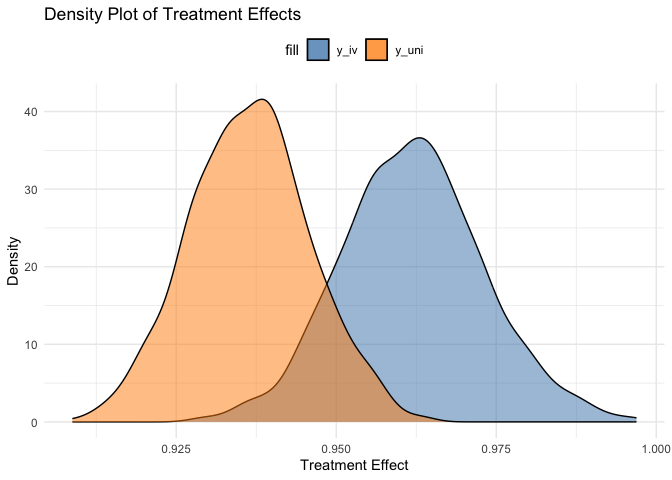

It is common to use instrumental variable regression for analyzing
experiments, e.g., GOTV, and lotteries, where only a fraction of the
people comply. One of the standard assumptions behind the standard LATE
estimate is that only compliers are going to see a treatment effect. For
instance, we don’t expect GOTV efforts over the phone to affect people
we aren’t able to reach. Or we don’t expect people who were merely drawn
up in the Vietnam Draft Lottery to have different attitudes towards
minorities. Whatever effects we see, we expect them to result from
service. All of this implies that the distribution of ITT looks closer
to Figure 1d [here
(pdf)](http://www.stat.columbia.edu/~gelman/research/unpublished/causal_quartets.pdf)

One way to check if the data are consistent with the implications of how
the effect is distributed is to simulate the lumpy treatment effect and
then check how closely the empirical distribution matches the theorized.

Let’s start by simulating some data — a treatment vector, a compliance
vector with compliance probability of .1, two variables,
*y**i**v*, which draws from a random normal that has a mean
of 5 and standard deviation of 2 except in the complier-treatment group
where the mean is 10. The *y**u**n**i* draws from a random
normal with mean 5 and standard deviation 2 in the control group. In the
treatment group, it takes the mean that is shifted by the average
treatment effect of *y**i**v*.

    # Load required libraries
    library(ggplot2)
    library(dplyr)

    ## 
    ## Attaching package: 'dplyr'

    ## The following objects are masked from 'package:stats':
    ## 
    ##     filter, lag

    ## The following objects are masked from 'package:base':
    ## 
    ##     intersect, setdiff, setequal, union

    # Set seed for reproducibility
    set.seed(123)

    n_resp = 10000
    # Generate random treatment variable (1 or 0)
    treatment <- rbinom(n = n_resp, size = 1, prob = 0.5)

    # Generate random compliance variable (1 or 0)
    compliance <- rbinom(n = n_resp, size = 1, prob = 0.2)

    treat_compliers = sum()

    # Generate y_iv variable
    y_iv <- ifelse(treatment == 1 & compliance == 1, 
                   rnorm(n = n_resp, mean = 10, sd = 2), 
                   rnorm(n = n_resp, mean = 5, sd = 2))

    # Calculate the overall mean effect of treatment for y_iv
    mean_effect <- mean(y_iv[treatment == 1]) - mean(y_iv[treatment == 0])

    # Generate y_uni variable with the same average effect of treatment as y_iv
    y_uni <- ifelse(treatment == 1,
                    rnorm(n = n_resp, mean = 5 + mean_effect, sd = 2), 
                    rnorm(n = n_resp, mean = 5, sd = 2))

    # Create a data frame with the simulated data
    data <- data.frame(treatment = treatment, compliance = compliance, y_iv = y_iv, y_uni = y_uni)

    # Calculate the treatment effect for y_uni
    treatment_effect_uni <- mean(data$y_uni[data$treatment == 1]) - mean(data$y_uni[data$treatment == 0])

    # Calculate the treatment effect for y_iv
    treatment_effect_iv <- mean(data$y_iv[data$treatment == 1]) - mean(data$y_iv[data$treatment == 0])

    # Print the treatment effect sizes
    cat("Treatment Effect Size (y_uni):", treatment_effect_uni, "\n")

    ## Treatment Effect Size (y_uni): 0.9363948

    cat("Treatment Effect Size (y_iv):", treatment_effect_iv, "\n")

    ## Treatment Effect Size (y_iv): 0.9619376

    data %>% 
        group_by(treatment, compliance) %>% 
        summarize(mean(y_iv), mean(y_uni))

    ## `summarise()` has grouped output by 'treatment'. You can override using the
    ## `.groups` argument.

    ## # A tibble: 4 × 4
    ## # Groups:   treatment [2]
    ##   treatment compliance `mean(y_iv)` `mean(y_uni)`
    ##       <int>      <int>        <dbl>         <dbl>
    ## 1         0          0         5.00          5.00
    ## 2         0          1         4.99          5.01
    ## 3         1          0         4.98          5.92
    ## 4         1          1        10.0           6.01

    summary(lm(y_iv ~ treatment))

    ## 
    ## Call:
    ## lm(formula = y_iv ~ treatment)
    ## 
    ## Residuals:
    ##     Min      1Q  Median      3Q     Max 
    ## -7.0907 -1.6744 -0.1708  1.4772 10.5768 
    ## 
    ## Coefficients:
    ##             Estimate Std. Error t value Pr(>|t|)    
    ## (Intercept)  4.99892    0.03432  145.67   <2e-16 ***
    ## treatment    0.96194    0.04881   19.71   <2e-16 ***
    ## ---
    ## Signif. codes:  0 '***' 0.001 '**' 0.01 '*' 0.05 '.' 0.1 ' ' 1
    ## 
    ## Residual standard error: 2.44 on 9998 degrees of freedom
    ## Multiple R-squared:  0.03739,    Adjusted R-squared:  0.0373 
    ## F-statistic: 388.4 on 1 and 9998 DF,  p-value: < 2.2e-16

    summary(lm(y_uni ~ treatment))

    ## 
    ## Call:
    ## lm(formula = y_uni ~ treatment)
    ## 
    ## Residuals:
    ##     Min      1Q  Median      3Q     Max 
    ## -7.1853 -1.3657  0.0258  1.3422  7.6009 
    ## 
    ## Coefficients:
    ##             Estimate Std. Error t value Pr(>|t|)    
    ## (Intercept)  5.00510    0.02814   177.9   <2e-16 ***
    ## treatment    0.93639    0.04002    23.4   <2e-16 ***
    ## ---
    ## Signif. codes:  0 '***' 0.001 '**' 0.01 '*' 0.05 '.' 0.1 ' ' 1
    ## 
    ## Residual standard error: 2.001 on 9998 degrees of freedom
    ## Multiple R-squared:  0.05191,    Adjusted R-squared:  0.05181 
    ## F-statistic: 547.4 on 1 and 9998 DF,  p-value: < 2.2e-16

Let’s simulate out the treatment effects if we randomly drop 5% of the
data for the two variables.

    num_simulations <- 1000

    # Function to calculate treatment effect
    calculate_effect <- function(data, variable) {
      treatment_effect <- mean(data[[variable]][data$treatment == 1]) - mean(data[[variable]][data$treatment == 0])
      return(treatment_effect)
    }
    # Function to simulate treatment effects
    simulate_effects <- function(data, variables) {
      treatment_effects <- lapply(variables, function(variable) {
        replicate(num_simulations, {
          sampled_data <- data[sample(nrow(data), replace = FALSE), ]
          dropped_rows <- sample(nrow(sampled_data), nrow(sampled_data) * 0.05)
          sampled_data <- sampled_data[-dropped_rows, ]
          calculate_effect(sampled_data, variable)
        })
      })
      return(treatment_effects)
    }

    # Define variables for treatment effects
    variables <- c("y_iv", "y_uni")

    # Simulate treatment effects for y_iv and y_uni
    treatment_effects <- simulate_effects(data, variables)

    # Extract treatment effects for y_iv and y_uni
    treatment_effects_iv <- treatment_effects[[1]]
    treatment_effects_uni <- treatment_effects[[2]]

    # Plot histograms of treatment effects side by side
    plot_data <- data.frame(Treatment_Effect_IV = treatment_effects_iv, Treatment_Effect_Uni = treatment_effects_uni)

    # Plot density of treatment effects with legend
    ggplot(plot_data) +
      geom_density(aes(Treatment_Effect_IV, fill = "y_iv"), alpha = 0.5) +
      geom_density(aes(Treatment_Effect_Uni, fill = "y_uni"), alpha = 0.5) +
      labs(x = "Treatment Effect", y = "Density", title = "Density Plot of Treatment Effects") +
      theme_minimal() +
      theme(legend.position = "top") +
      scale_fill_manual(values = c("y_iv" = "steelblue", "y_uni" = "darkorange"),
                        labels = c("y_iv", "y_uni"))

    # Calculate the frequency at which y_iv effect is greater than y_uni effect
    frequency <- sum(treatment_effects_iv > treatment_effects_uni) / num_simulations
    frequency

    ## [1] 0.952
